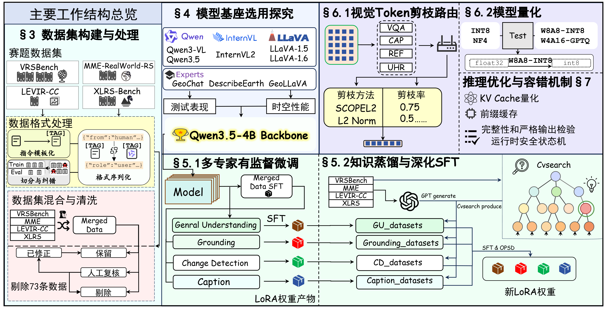

## 目录

- [一、基本信息](#一基本信息)
  - [1.1 摘要](#11-摘要)
  - [1.2 主要工作](#12-主要工作)
  - [1.3 项目分工](#13-项目分工)
- [二、项目概述](#二项目概述)
  - [2.1 整体架构图](#21-整体架构图)
- [三、快速开始](#三快速开始)
  - [3.1 硬件要求](#31-硬件要求)
  - [3.2 环境配置](#32-环境配置)
  - [3.3 模型推理](#33-模型推理)
  - [3.4 模型评测](#34-模型评测)
  - [3.5 模型训练](#35-模型训练)
- [四、测试结果](#四测试结果)
- [五、目录索引](#五目录索引)
- [六、Acknowledgment](#六acknowledgment)

---

## 一、基本信息

### 1.1 摘要

随着多模态大模型（MLLMs）的变革性发展与太空智算科技的兴起，运用其强大的理解能力来克服卫星图像处理中面临的高分辨率解析困难与泛化能力弱等挑战已成为当前的重要课题。然而，现有的通用大模型难以直接适应超高分辨率的遥感图像，且卫星平台严苛的算力与内存瓶颈进一步限制了其端侧部署。

为突破通用模型能力的限制，本团队针对星载任务的难度大、资源极度受限的特点，设计了一套高效的、出色的多模态大模型轻量化部署方案。整个方案按序完成了数据集处理——基座模型选型——模型训练——模型轻量化——容错与故障恢复机制的设计链条，成功基于轻量的模型达到了优秀的表现效果。在基座选型上，本方案对比了目前先进的Qwen、LLaVA、InternVL通用多模态大模型系列及部分遥感专家模型，充分比较了模型的表现与实际应用场景，最终选定 **Qwen3.5-4B** 作为方案的模型基座。鉴于所有的通用模型基座在赛题数据集，尤其是高分辨率的两个数据集上的表现存在如输出格式错误和指令遵循能力差的明显缺陷，本方案深入调研了当前有效的模型训练方法，并引入了本团队先前在ICML26中提出的CVSearch框架。基于四个指定的竞赛数据集，本方案协同应用了多专家有监督微调与在线策略蒸馏的训练方法，显著增强了模型对复杂遥感任务的适应性，使模型基座的性能完成了质变。接下来，为了丰富训练数据，团队利用GPT模型生成了数千条额外数据，并依此进行深化的微调工作，进一步优化了模型在任务中的表现效果。

在模型轻量化的方面，我们结合了视觉Token剪枝与模型量化策略。我们通过消融实验发现，不同的数据集和任务类型对于视觉Token剪枝的敏感性和方法要求是有显著差异的。基于这个发现，我们基于免训练的视觉Token剪枝方法，设计了任务适应的Token剪枝路由机制。同时，我们使用了$\mathrm{W8A8}$/$\mathrm{W4A16}$ 训练后量化方法。该方法大幅减少了计算开销，将压缩存储开销控制在8G以内。随后，为了增强模型在太空辐射环境下的鲁棒性，我们实现了针对单粒子翻转的容错机制，保证了卫星侧推理的稳定性。实验表明，本方案在满足星载端侧严苛资源约束的同时，仍保持了优异的遥感理解与推理性能。

### 1.2 主要工作

1. 我们充分调研了赛题的具体需求、提供的数据集和当前的遥感多模态大模型工作成果，构建了从基座选型到星载端侧部署的完整技术链路；
2. 我们创新性地提出了一套多阶段协同训练方案。结合多专家有监督微调（SFT）、在线策略蒸馏（OPD）以及 CVSearch 框架，并通过大模型合成数据深化微调，我们成功大幅跨越了通用大模型在复杂高分辨遥感任务上的性能鸿沟；
3. 我们设计了任务适应的高效模型轻量化策略。我们提出了一种免训练的视觉 Token 剪枝路由机制，在精准削减冗余 视觉 Token 的同时保留了核心视觉特征，并配合 W8A8/W4A16 训练后量化，实现与星载硬件资源环境的适配；
4. 最终，我们实现了高可靠的星载容错机制。针对太空辐射环境，我们设计了应对单粒子翻转的底层容错与故障恢复策略，保障了极端严苛资源约束下的系统推理稳定性。

### 1.3 项目分工
<!-- 表格容器 -->
<div style="overflow-x: auto;">
  <table border="1" cellspacing="0" cellpadding="8" style="border-collapse: collapse; min-width: 1000px; table-layout: fixed; width: 100%;">
    <thead>
      <tr>
        <th style="width: 120px; white-space: nowrap;">姓名</th>
        <th style="width: 260px;">负责模块</th>
        <th>工作内容</th>
      </tr>
    </thead>
    <tbody>
      <tr>
        <td>
          <div style="white-space: nowrap; overflow: hidden; text-overflow: ellipsis;"><strong>赖培丰　</strong></div>
        </td>
        <td>...</td>
        <td>
1. ...<br>
2. ...
        </td>
      </tr>
      <tr>
        <td>
          <div style="white-space: nowrap; overflow: hidden; text-overflow: ellipsis;"><strong>曹鹏宇</strong></div>
        </td>
        <td>...</td>
        <td>
1. ...<br>
2. ...
        </td>
      </tr>
      <tr>
        <td>
          <div style="white-space: nowrap; overflow: hidden; text-overflow: ellipsis;"><strong>王翰　</strong></div>
        </td>
        <td>...</td>
        <td>
1. ...<br>
2. ...
        </td>
      </tr>
      <tr>
        <td>
          <div style="white-space: nowrap; overflow: hidden; text-overflow: ellipsis;"><strong>曹忠博　</strong></div>
        </td>
        <td>...</td>
        <td>
1. ...<br>
2. ...
        </td>
      </tr>
      <tr>
        <td>
          <div style="white-space: nowrap; overflow: hidden; text-overflow: ellipsis;"><strong>孙昊　</strong></div>
        </td>
        <td>...</td>
        <td>
1. ...<br>
2. ...
        </td>
      </tr>
      <tr>
        <td>
          <div style="white-space: nowrap; overflow: hidden; text-overflow: ellipsis;"><strong>李刘鹏　</strong></div>
        </td>
        <td>...</td>
        <td>
1. ...<br>
2. ...
        </td>
      </tr>
    </tbody>
  </table>
</div>

---

## 二、项目概述

### 2.1 整体架构图



---

## 三、 快速开始

### 3.1 硬件要求

- **显卡**：NVIDIA GPU，显存 ≥ 12 GB，CUDA 计算能力 ≥ 8.0（Ampere 级及更高）
- **CPU**：建议 x86_64
- **内存**：建议 ≥ 32 GB
- **存储**：建议 ≥ 100 GB
- 系统：建议 Ubuntu 22.04

> **备注**：实际资源消耗量远低于此规格。本项目未在其他硬件配置上运行过，不保证完全兼容。

### 3.2 环境配置

**方式一：uv （推荐）**

```bash
uv sync --locked            # 按 uv.lock 精确安装 121 个依赖（CUDA 12.8 + torch 2.8.0）
source .venv/bin/activate
```

**方式二：Docker 容器（推荐**

```bash
docker build -t rs-mllm .
docker run --gpus all -it -v $(pwd):/workspace rs-mllm bash
```

**方式三：一键配置（`setup.sh` 自动识别 uv/conda 并自动进入环境）**

```bash
bash setup.sh                                              # 训练/推理环境(torch 2.8 cu128)
bash evaluation/vllm_eval/setup_env.sh                     # vLLM 评测环境(vllm 0.26 cu129)
```

> 评测器依赖 vllm 0.26，要用 `evaluation/vllm_eval` 的评测环境，不能用 3.2 的训练环境。
>
> 首次安装需下载约 4GB（torch/nvidia/vllm wheel）。若下载卡住无进度，
> 设置代理后重跑：`export HTTPS_PROXY=http://<代理>:<端口> HTTP_PROXY=http://<代理>:<端口>`。

### 3.3 模型推理

**唯一入口：交互式控制台**（菜单选择功能，模型自动从 ModelScope 拉取）

```bash
./rsmllm.sh
```

菜单：
- `[1]` 模型评测（选模型/清单/profile，跑测试集出准确率）
- `[2]` 推理服务（默认 **WebUI 网页推理**：浏览器 http://127.0.0.1:7860 上传图片/文字对话；也可 CLI）
- `[3]` 训练 / `[4]` 量化 / `[5]` 数据预处理 / `[7]` 容错探针

**多专家路由推理**（报告 §5.3：4 专家按 prompt 规则路由）：

```bash
# 1) 一键启动 4 个专家实例(默认模型在 ~/router_models/ 或 ModelScope 自动拉取)
#    general=8001 grounding=8002 change=8003 caption=8004, 两卡分载
bash scripts/start_router.sh

# 2) 交互路由对话(自动按规则分发到对应专家)
python -m rsmllm.router --chat
#   "Describe the image in detail" → caption
#   "[REF] Where is the building?" → grounding
#   "Describe the changes"         → change
#   "What color is the roof?"      → general
```

> 路由规则与评测链路一致（`evaluation/router/rules.py`：`[VQA]`/默认→general、
> `[REF]`/where→grounding、`[CD]`/change→change、`[CAP]`/describe→caption）。
> 实例按需启停（`pkill -f "vllm.entrypoints"`），用完释放显存不影响评测。

支持的模型别名见 `rsmllm/config.py` 的 `MODEL_REGISTRY`（如 `base`、`mmerestore_bf16`、
`w8a8`、`gptq`、`expert_general`、`expert_general_w8a8` 等），
或直接给 ModelScope id / 本地路径。模型按需下载缓存在 `.models/`（
`RSMLLM_MODEL_CACHE` 可覆盖），离线时 `MODELSCOPE_OFFLINE=1` 强制本地命中。

**专家模型架构**（与训练口径一致）：

| 别名 | 内容 | 说明 |
|---|---|---|
| `expert_general` / `expert_ground` | **base + delta + LoRA（已合并一次）** | canonical 评测模型；附带 `merge_manifest.json` |
| `expert_general_lora` / `expert_ground_lora` | PEFT LoRA adapter（rank 32）| 合并来源记录；不要再叠加到 canonical 快照 |
| `expert_general_full` / `expert_ground_full` | 历史二次合并产物 | **别名已停用，禁止用于新评测** |
| `expert_change` / `expert_caption` | base + delta（合并）| 无 LoRA（训练口径无）|
| `expert_*_w8a8` / `expert_*_gptq` | canonical 专家量化版 | 从一次合并后的专家快照生成 |

`expert_general` / `expert_ground` 的 `merge_manifest.json` 已明确记录
`raw_base → expert_delta → peft_lora`，所以它们就是队友完整架构的 canonical
结果。旧的 `_full` 目录是在该快照上再次合并同一个 adapter 产生的二次合并结果；
`router_eval` 不再选择它们。`scripts/merge_lora_to_model.py` 对已有合并记录会
直接拒绝，防止再次叠加；量化模型使用 canonical 快照生成的产物，vLLM 离线 API
不动态挂 LoRA。

### 3.4 模型评测

```bash
# 一次性建评测环境
bash evaluation/vllm_eval/setup_env.sh

# 单专家评测，模型自动从 ModelScope 拉取
evaluation/vllm_eval/.venv/bin/python evaluation/main.py \
    --adapter qwen35vl \
    --model-path <expert_caption路径: 本地目录 或 ModelScope 别名 expert_caption> \
    --datasets vrsbench --subtask caption

# 一键路由专家评测（4 专家×对应任务；只选择量化方式）
evaluation/vllm_eval/.venv/bin/python -m rsmllm.router_eval --quant bf16
# 量化方式可选: bf16 / w8a8 / gptq
```

评测首次会自动创建 `datasets/` 并从 ModelScope/HF 镜像（`hf-mirror.com`，`HF_ENDPOINT` 可覆盖）下载评测图片到 `datasets/shared_datasets/<数据名>/`，并自动构建可移植评测清单（图片相对路径 + 真实尺寸）到 `evaluation/vllm_eval/manifests/`，见 `rsmllm/data.py::prepare_eval`。清单为生成产物，首次评测时自动构建。

**从 HuggingFace 官方数据集导入**：

评测图片也可以直接从 HF 官方源下载，脚本自动解压摆放到评测清单对应的位置：

```bash
# 方式一：一键(推荐, 约 8.8GB, 快) —— 从 ModelScope 下载已清洗裁剪的图片包
python scripts/fetch_benchmark_data.py --all
#   下载 6 个数据集的图片并自动摆放:
#   datasets/shared_datasets/VRSBench/        (vrsbench 9,350 张)
#   datasets/shared_datasets/MME-RealWorld-RS/ (mme 1,264 张)
#   datasets/shared_datasets/XLRS-Bench-lite/  (xlrs 800 张)
#   datasets/shared_datasets/LEVIR-CC/         (levircc 3,858 张)
#   datasets/shared_datasets/XLRS-Bench_caption_en/       (xlrs_caption 934 张)
#   datasets/shared_datasets/XLRS-Bench_visual_grounding_en/ (xlrs_grounding 844 张)

# 方式二：从 HF 官方源下载(全量, 体积大: XLRS 系列 38~127GB, 慢)
python scripts/fetch_benchmark_data.py --all --source hf
#   仅指定数据集:
python scripts/fetch_benchmark_data.py --dataset vrsbench --source hf
```

**目录契约**：图片必须位于 `datasets/shared_datasets/<数据名>/`，评测清单中的图片路径
以此为根（`build_sample_manifest.py` 已按此生成）：

```
datasets/shared_datasets/
├── VRSBench/                          # vrsbench: 官方 Images_val.zip 原文件名直放
│   └── images/val/P0003_0002.png      #   清单引用名 = 官方 image_id, 解压即用
├── MME-RealWorld-RS/                  # mme: 官方 images_resized/mme_*.png
├── XLRS-Bench-lite/                   # xlrs: images_resized/xlrs_00000.png (重编号)
├── XLRS-Bench_caption_en/             # xlrs_caption: images_exported/xlrs_caption_*.jpg
├── XLRS-Bench_visual_grounding_en/    # xlrs_grounding: images_exported_test/xlrs_vg_*.jpg
└── LEVIR-CC/                          # levircc: 官方 zip 原文件名直放
    └── images/test/A/test_000001.png
```

**命名规则**：
- VRSBench / LEVIR-CC：官方文件就是清单引用名（`P0003_0002.png` / `test_000001.png`），
  zip 解压后文件自然对上，无需改名；
- XLRS 三件套 / MME：清单引用的是**预处理重编号名**（`images_resized/xlrs_00000.png`、
  `images_exported/xlrs_caption_00000.jpg`），HF 官方是 arrow 内嵌图，脚本按 `index`
  列顺序导出并重编号（与评测清单一一对应）。

**图片放在别处时**：不要求一定放 `datasets/shared_datasets/`，可用
`build_sample_manifest.py --images-root <你的图片目录>` 重写清单中的路径前缀：
```bash
python scripts/build_sample_manifest.py --all --images-root /path/to/your/images
```

菜单路径：`./rsmllm.sh` → `[5] 数据预处理` → `download`。

**量化转换**（与报告同链路）：

```bash
python -m rsmllm.quantize --method w8a8-int8 --model mmerestore_bf16 \
  --calibration calibration_512.jsonl --output quantized_models/out
```

**容错探针 / TTFT / 并发扫描 / 剪枝**（实验级入口）：

```bash
python scripts/quant_tol_probe.py \
  --model bf16 --model-dir /path/to/bf16 \
  --model w8a8 --model-dir /path/to/w8a8 \
  --model gptq --model-dir /path/to/gptq \
  --out-dir results/quant_tol_probe     # 容错探针: 位翻转 + 哈希检测率 + 输出漂移
python scripts/ttft_serve_probe.py      # vLLM serve /metrics TTFT
python scripts/run_batch_scan.py        # 6 档并发吞吐/时延扫描
python evaluation/run_prune_sweep.py    # Token 剪枝方法扫描
```

### 3.5 模型训练

所有命令从仓库根目录执行；训练默认关闭 thinking。

#### 环境

```bash
conda create -n rs_mllm python=3.10 -y
conda activate rs_mllm
python -m pip install 'uv==0.12.8'
uv pip install --python "$CONDA_PREFIX/bin/python" --torch-backend cu128 \
  -r pyproject.toml \
  -r training/distillation/expert_lora/requirements.txt \
  'modelscope==1.39.1' 'modelscope-hub==0.3.0'
export CONDA_ENV=rs_mllm
```

已验证环境：A100、Python 3.10.20、CUDA 12.8、PyTorch 2.8.0、
Transformers 5.13.0、DeepSpeed 0.17.5、PEFT 0.15.2。

#### 准备模型和数据

原数据集不随仓库和改编 JSON 重复发布。已有原数据时，请按以下名称放到
`datasets/`（也可以放软链）；压缩包需先解压，XLRS 的 Hugging Face Arrow 可原样保留：

```text
datasets/
├── MME-RealWorld-RS/
├── VRSBench/
├── XLRS-Bench-lite/
├── XLRS-Bench_visual_grounding_en/
├── LEVIR-CC/
└── training35/                 # 脚本下载/生成的改编 JSON 与内容哈希图片
```

依次运行：

```bash
# base 与四个无 LoRA 专家；缺失时从 ModelScope 下载，已有目录则直接复用
python scripts/stage_training35_models.py --download

# 从 ModelScope 下载五阶段及 General/Grounding 改编 JSON
python scripts/fetch_training35_data.py

# 从 datasets/ 原图恢复 XLRS 844 图、建立内容哈希链接并校验 SHA-256
python scripts/prepare_training35_images.py

# 建立统一训练路径并做 CPU 完整预检
python scripts/stage_training35_data.py
python scripts/preflight_training35.py
```

运行前可加 `--dry-run` 检查前 3 条准备命令的来源和目标，不会下载或扫描大文件。
模型来自 ModelScope `Fun10165/rs-mllm-*`；五阶段 JSON 来自
`yasumi/rs-mllm-datasets`；续训练 JSON 来自
`Uchitachi/RS-MLLM-Distillation-Data`。原数据需自行取得并按上述目录放置；
`training/distillation/expert_lora/scripts/download_official_datasets.sh` 仅用于下载和
校验专家续训练所需的部分官方图像，不能代替完整五阶段数据准备，也不包含
LEVIR-CC。MME 下载前需阅读并同意其许可。由于原图可达数百 GB，官方下载不会
被上述准备命令隐式触发。

#### 五阶段训练

首次运行建议先做单卡 smoke test：

```bash
bash scripts/train.sh smoke-all --gpus 1 --max-updates 1
```

smoke 通过后，完整训练在本地与 Slurm 中二选一，不要依次执行：

```bash
bash scripts/train.sh all               # 本地完整依赖流水线
bash scripts/train.sh --slurm all       # Slurm afterok 完整依赖流水线
```

以下单阶段命令仅用于调试或断点续跑；运行前须确保它依赖的上游阶段已在同一
`run-id` 下完成：

```bash
bash scripts/train.sh stage1_clean      # 统一 SFT 主干
bash scripts/train.sh ga2_general       # General 续训
bash scripts/train.sh a1_grounding      # Grounding 续训
bash scripts/train.sh a2b_change        # Change 续训
bash scripts/train.sh caption           # Caption 双域训练
```

#### General / Grounding 续训练

以下是 30 updates 的功能验收，不用于复现历史最终指标：

```bash
ARTIFACT_ROOT="$PWD/models/training35/runs/training35-short"

# expert_general -> expert_general_lora
bash training/train_general_expert.sh \
  --gpus 1 --max-updates 30 --output-root "$ARTIFACT_ROOT"

# expert_ground -> bootstrap -> expert_ground_lora
bash training/train_grounding_expert.sh \
  --stage bootstrap --gpus 1 --output-root "$ARTIFACT_ROOT"
bash training/train_grounding_expert.sh \
  --stage final --gpus 1 --max-updates 30 \
  --init-lora "$ARTIFACT_ROOT/bootstrap/expert_ground_lora" \
  --output-root "$ARTIFACT_ROOT"
```

复现完整历史训练时，另设 `ARTIFACT_ROOT="$PWD/models/training35/runs/training35-full"`，并使用 General
4 卡/484 updates、Grounding bootstrap 4 卡/30 updates、Grounding final
8 卡/1370 updates；将上述 `--gpus` 和 `--max-updates` 相应替换即可。

合并完整模型：

```bash
bash scripts/merge_checkpoint.sh \
  --base models/expert_general \
  --lora "$ARTIFACT_ROOT/expert_general_lora" \
  --output "$ARTIFACT_ROOT/expert_general_full"

bash scripts/merge_checkpoint.sh \
  --base models/expert_ground \
  --lora "$ARTIFACT_ROOT/expert_ground_lora" \
  --output "$ARTIFACT_ROOT/expert_ground_full"
```

#### 数据构建与 delta

以下命令不是训练前置步骤，仅在需要重新构建数据或导出四专家 delta 时运行：

```bash
python scripts/build_caption_expert_data.py
python scripts/generate_mcq_data.py
python scripts/gen_expert_deltas.py --verify
```

四个 raw delta 写入 `models/training35/deltas/`，命名为
`expert_general.pt`、`expert_ground.pt`、`expert_change.pt`、`expert_caption.pt`。

---

## 四、测试结果

## 五、目录索引

## 六、Acknowledgment
