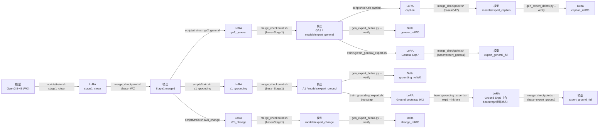

## 目录

- [一、基本信息](#一基本信息)
  - [1.1 摘要](#11-摘要)
  - [1.2 主要工作](#12-主要工作)
  - [1.3 项目分工](#13-项目分工)
- [二、项目概述](#二项目概述)
  - [2.1 整体架构图](#21-整体架构图)
- [三、快速开始](#三快速开始)
  - [3.1 硬件要求](#31-硬件要求)
  - [3.2 环境配置](#32-环境配置)
  - [3.3 模型推理](#33-模型推理)
  - [3.4 模型评测](#34-模型评测)
  - [3.5 模型训练](#35-模型训练)
- [四、测试结果](#四测试结果)
- [五、目录索引](#五目录索引)
- [六、Acknowledgment](#六acknowledgment)

---

## 一、基本信息

### 1.1 摘要

随着多模态大模型（MLLMs）的变革性发展与太空智算科技的兴起，运用其强大的理解能力来克服卫星图像处理中面临的高分辨率解析困难与泛化能力弱等挑战已成为当前的重要课题。然而，现有的通用大模型难以直接适应超高分辨率的遥感图像，且卫星平台严苛的算力与内存瓶颈进一步限制了其端侧部署。

为突破通用模型能力的限制，本团队针对星载任务的难度大、资源极度受限的特点，设计了一套高效的、出色的多模态大模型轻量化部署方案。整个方案按序完成了数据集处理——基座模型选型——模型训练——模型轻量化——容错与故障恢复机制的设计链条，成功基于轻量的模型达到了优秀的表现效果。在基座选型上，本方案对比了目前先进的Qwen、LLaVA、InternVL通用多模态大模型系列及部分遥感专家模型，充分比较了模型的表现与实际应用场景，最终选定 **Qwen3.5-4B** 作为方案的模型基座。鉴于所有的通用模型基座在赛题数据集，尤其是高分辨率的两个数据集上的表现存在如输出格式错误和指令遵循能力差的明显缺陷，本方案深入调研了当前有效的模型训练方法，并引入了本团队先前在ICML26中提出的CVSearch框架。基于四个指定的竞赛数据集，本方案协同应用了多专家有监督微调与在线策略蒸馏的训练方法，显著增强了模型对复杂遥感任务的适应性，使模型基座的性能完成了质变。接下来，为了丰富训练数据，团队利用GPT模型生成了数千条额外数据，并依此进行深化的微调工作，进一步优化了模型在任务中的表现效果。

在模型轻量化的方面，我们结合了视觉Token剪枝与模型量化策略。我们通过消融实验发现，不同的数据集和任务类型对于视觉Token剪枝的敏感性和方法要求是有显著差异的。基于这个发现，我们基于免训练的视觉Token剪枝方法，设计了任务适应的Token剪枝路由机制。同时，我们使用了$\mathrm{W8A8}$/$\mathrm{W4A16}$ 训练后量化方法。该方法大幅减少了计算开销，将压缩存储开销控制在8G以内。随后，为了增强模型在太空辐射环境下的鲁棒性，我们实现了针对单粒子翻转的容错机制，保证了卫星侧推理的稳定性。实验表明，本方案在满足星载端侧严苛资源约束的同时，仍保持了优异的遥感理解与推理性能。

### 1.2 主要工作

1. 我们充分调研了赛题的具体需求、提供的数据集和当前的遥感多模态大模型工作成果，构建了从基座选型到星载端侧部署的完整技术链路；
2. 我们创新性地提出了一套多阶段协同训练方案。结合多专家有监督微调（SFT）、在线策略蒸馏（OPD）以及 CVSearch 框架，并通过大模型合成数据深化微调，我们成功大幅跨越了通用大模型在复杂高分辨遥感任务上的性能鸿沟；
3. 我们设计了任务适应的高效模型轻量化策略。我们提出了一种免训练的视觉 Token 剪枝路由机制，在精准削减冗余 视觉 Token 的同时保留了核心视觉特征，并配合 W8A8/W4A16 训练后量化，实现与星载硬件资源环境的适配；
4. 最终，我们实现了高可靠的星载容错机制。针对太空辐射环境，我们设计了应对单粒子翻转的底层容错与故障恢复策略，保障了极端严苛资源约束下的系统推理稳定性。

### 1.3 项目分工
<!-- 表格容器 -->
<div style="overflow-x: auto;">
  <table border="1" cellspacing="0" cellpadding="8" style="border-collapse: collapse; min-width: 1000px; table-layout: fixed; width: 100%;">
    <thead>
      <tr>
        <th style="width: 120px; white-space: nowrap;">姓名</th>
        <th style="width: 260px;">负责模块</th>
        <th>工作内容</th>
      </tr>
    </thead>
    <tbody>
      <tr>
        <td>
          <div style="white-space: nowrap; overflow: hidden; text-overflow: ellipsis;"><strong>赖培丰　</strong></div>
        </td>
        <td>...</td>
        <td>
1. ...<br>
2. ...
        </td>
      </tr>
      <tr>
        <td>
          <div style="white-space: nowrap; overflow: hidden; text-overflow: ellipsis;"><strong>曹鹏宇</strong></div>
        </td>
        <td>...</td>
        <td>
1. ...<br>
2. ...
        </td>
      </tr>
      <tr>
        <td>
          <div style="white-space: nowrap; overflow: hidden; text-overflow: ellipsis;"><strong>王翰　</strong></div>
        </td>
        <td>...</td>
        <td>
1. ...<br>
2. ...
        </td>
      </tr>
      <tr>
        <td>
          <div style="white-space: nowrap; overflow: hidden; text-overflow: ellipsis;"><strong>曹忠博　</strong></div>
        </td>
        <td>...</td>
        <td>
1. ...<br>
2. ...
        </td>
      </tr>
      <tr>
        <td>
          <div style="white-space: nowrap; overflow: hidden; text-overflow: ellipsis;"><strong>孙昊　</strong></div>
        </td>
        <td>...</td>
        <td>
1. ...<br>
2. ...
        </td>
      </tr>
      <tr>
        <td>
          <div style="white-space: nowrap; overflow: hidden; text-overflow: ellipsis;"><strong>李刘鹏　</strong></div>
        </td>
        <td>...</td>
        <td>
1. ...<br>
2. ...
        </td>
      </tr>
    </tbody>
  </table>
</div>

---

## 二、项目概述

### 2.1 整体架构图


---

## 三、 快速开始

### 3.1 硬件要求

- **显卡**：NVIDIA GPU，显存 ≥ 12 GB，CUDA 计算能力 ≥ 8.0（Ampere 级及更高）
- **CPU**：建议 x86_64
- **内存**：建议 ≥ 32 GB
- **存储**：建议 ≥ 100 GB
- 系统：建议 Ubuntu 22.04

> **备注**：实际资源消耗量远低于此规格。本项目未在其他硬件配置上运行过，不保证完全兼容。

### 3.2 环境配置

**方式一：uv （推荐）**

```bash
uv sync --locked            # 按 uv.lock 精确安装 121 个依赖（CUDA 12.8 + torch 2.8.0）
source .venv/bin/activate
```

**方式二：Docker 容器（推荐**

```bash
docker build -t rs-mllm .
docker run --gpus all -it -v $(pwd):/workspace rs-mllm bash
```

**方式三：一键配置（`setup.sh` 自动识别 uv/conda 并自动进入环境）**

```bash
bash setup.sh                                              # 训练/推理环境(torch 2.8 cu128)
bash evaluation/vllm_eval/setup_env.sh                     # vLLM 评测环境(vllm 0.26 cu129)
```

> 评测器依赖 vllm 0.26，要用 `evaluation/vllm_eval` 的评测环境，不能用 3.2 的训练环境。
>
> 首次安装需下载约 4GB（torch/nvidia/vllm wheel）。若下载卡住无进度，
> 设置代理后重跑：`export HTTPS_PROXY=http://<代理>:<端口> HTTP_PROXY=http://<代理>:<端口>`。

### 3.3 模型推理

**唯一入口：交互式控制台**（菜单选择功能，模型自动从 ModelScope 拉取）

```bash
./rsmllm.sh
```

菜单：
- `[1]` 模型评测（选模型/清单/profile，跑测试集出准确率）
- `[2]` 推理服务（默认 **WebUI 网页推理**：浏览器 http://127.0.0.1:7860 上传图片/文字对话；也可 CLI）
- `[3]` 训练 / `[4]` 量化 / `[5]` 数据预处理 / `[7]` 容错探针

**多专家路由推理**（报告 §5.3：4 专家按 prompt 规则路由）：

```bash
# 1) 一键启动 4 个专家实例(默认模型在 ~/router_models/ 或 ModelScope 自动拉取)
#    general=8001 grounding=8002 change=8003 caption=8004, 两卡分载
bash scripts/start_router.sh

# 2) 交互路由对话(自动按规则分发到对应专家)
python -m rsmllm.router --chat
#   "Describe the image in detail" → caption
#   "[REF] Where is the building?" → grounding
#   "Describe the changes"         → change
#   "What color is the roof?"      → general
```

> 路由规则与评测链路一致（`evaluation/router/rules.py`：`[VQA]`/默认→general、
> `[REF]`/where→grounding、`[CD]`/change→change、`[CAP]`/describe→caption）。
> 实例按需启停（`pkill -f "vllm.entrypoints"`），用完释放显存不影响评测。

支持的模型别名见 `rsmllm/config.py` 的 `MODEL_REGISTRY`（如 `base`、`mmerestore_bf16`、
`w8a8`、`gptq`、`expert_general`、`expert_general_w8a8` 等 15 个），
或直接给 ModelScope id / 本地路径。模型按需下载缓存在 `.models/`（
`RSMLLM_MODEL_CACHE` 可覆盖），离线时 `MODELSCOPE_OFFLINE=1` 强制本地命中。

**专家模型架构**（与训练口径一致）：

| 别名 | 内容 | 说明 |
|---|---|---|
| `expert_general` / `expert_ground` | base + 专家 delta（合并）| 无 LoRA 版 |
| `expert_general_lora` / `expert_ground_lora` | PEFT LoRA adapter（rank 32）| 需合并后使用 |
| `expert_general_full` / `expert_ground_full` | **base + delta + LoRA（完整）** | 推荐评测用 |
| `expert_change` / `expert_caption` | base + delta（合并）| 无 LoRA（训练口径无）|
| `expert_*_w8a8` / `expert_*_gptq` | 量化版 | 含 LoRA 版以 `_full` 为源量化 |

`_full` 模型 = 队友完整架构（`basemodel + expert(delta) + expert_lora(PEFT)` 合并），
评测器离线加载直接使用。合并脚本：`scripts/merge_lora_to_model.py`。

### 3.4 模型评测

```bash
# 一次性建评测环境
bash evaluation/vllm_eval/setup_env.sh

# 单专家评测，模型自动从 ModelScope 拉取
evaluation/vllm_eval/.venv/bin/python evaluation/main.py \
    --adapter qwen35vl \
    --model-path <expert_caption路径: 本地目录 或 ModelScope 别名 expert_caption> \
    --datasets vrsbench --subtask caption

# 一键路由专家评测（4 专家×对应任务）
evaluation/vllm_eval/.venv/bin/python -m rsmllm.router_eval --quant bf16
```

懒加载：图片 `datasets/shared_datasets/`、模型 `.models/`（`get_model` 自动下载）。`--subtask` 可选 `vqa/caption/referring/mcq/change`。结果写入 `--output` 指定 json。
> **数据懒加载**：评测首次会自动创建 `datasets/` 并从 ModelScope/HF 镜像
> （`hf-mirror.com`，`HF_ENDPOINT` 可覆盖）下载评测图片到 `datasets/shared_datasets/<数据名>/`，
> 并自动构建可移植评测清单（图片相对路径 + 真实尺寸）到 `evaluation/vllm_eval/manifests/`，
> 见 `rsmllm/data.py::prepare_eval`。清单为生成产物不入库，评委首次评测时自动构建。

**从 HuggingFace 官方数据集导入**：

评测图片也可以直接从 HF 官方源下载，脚本自动解压摆放到评测清单对应的位置：

```bash
# 方式一：一键(推荐, 约 8.8GB, 快) —— 从 ModelScope 下载已清洗裁剪的图片包
python scripts/fetch_benchmark_data.py --all
#   下载 6 个数据集的图片并自动摆放:
#   datasets/shared_datasets/VRSBench/        (vrsbench 9,350 张)
#   datasets/shared_datasets/MME-RealWorld-RS/ (mme 1,264 张)
#   datasets/shared_datasets/XLRS-Bench-lite/  (xlrs 800 张)
#   datasets/shared_datasets/LEVIR-CC/         (levircc 3,858 张)
#   datasets/shared_datasets/XLRS-Bench_caption_en/       (xlrs_caption 934 张)
#   datasets/shared_datasets/XLRS-Bench_visual_grounding_en/ (xlrs_grounding 844 张)

# 方式二：从 HF 官方源下载(全量, 体积大: XLRS 系列 38~127GB, 慢)
python scripts/fetch_benchmark_data.py --all --source hf
#   仅指定数据集:
python scripts/fetch_benchmark_data.py --dataset vrsbench --source hf
```

**目录契约**：图片必须位于 `datasets/shared_datasets/<数据名>/`，评测清单中的图片路径
以此为根（`build_sample_manifest.py` 已按此生成）：

```
datasets/shared_datasets/
├── VRSBench/                          # vrsbench: 官方 Images_val.zip 原文件名直放
│   └── images/val/P0003_0002.png      #   清单引用名 = 官方 image_id, 解压即用
├── MME-RealWorld-RS/                  # mme: 官方 images_resized/mme_*.png
├── XLRS-Bench-lite/                   # xlrs: images_resized/xlrs_00000.png (重编号)
├── XLRS-Bench_caption_en/             # xlrs_caption: images_exported/xlrs_caption_*.jpg
├── XLRS-Bench_visual_grounding_en/    # xlrs_grounding: images_exported_test/xlrs_vg_*.jpg
└── LEVIR-CC/                          # levircc: 官方 zip 原文件名直放
    └── images/test/A/test_000001.png
```

**命名规则**：
- VRSBench / LEVIR-CC：官方文件就是清单引用名（`P0003_0002.png` / `test_000001.png`），
  zip 解压后文件自然对上，无需改名；
- XLRS 三件套 / MME：清单引用的是**预处理重编号名**（`images_resized/xlrs_00000.png`、
  `images_exported/xlrs_caption_00000.jpg`），HF 官方是 arrow 内嵌图，脚本按 `index`
  列顺序导出并重编号（与评测清单一一对应）。

**图片放在别处时**：不要求一定放 `datasets/shared_datasets/`，可用
`build_sample_manifest.py --images-root <你的图片目录>` 重写清单中的路径前缀：
```bash
python scripts/build_sample_manifest.py --all --images-root /path/to/your/images
```

菜单路径：`./rsmllm.sh` → `[5] 数据预处理` → `download`。

**量化转换**（与报告同链路）：

```bash
python -m rsmllm.quantize --method w8a8-int8 --model mmerestore_bf16 \
  --calibration calibration_512.jsonl --output quantized_models/out
```

**容错探针 / TTFT / 并发扫描 / 剪枝**（实验级入口）：

```bash
python scripts/quant_tol_probe.py \
  --model bf16 --model-dir /path/to/bf16 \
  --model w8a8 --model-dir /path/to/w8a8 \
  --model gptq --model-dir /path/to/gptq \
  --out-dir results/quant_tol_probe     # 容错探针: 位翻转 + 哈希检测率 + 输出漂移
python scripts/ttft_serve_probe.py      # vLLM serve /metrics TTFT
python scripts/run_batch_scan.py        # 6 档并发吞吐/时延扫描
python evaluation/run_prune_sweep.py    # Token 剪枝方法扫描
```

### 3.5 模型训练

本节只覆盖报告第 5 章的训练验收。五阶段 SFT 与 General/Grounding 续训练均关闭
thinking；运行产物统一写入 `outputs/training35/<run-id>/`，不会覆盖正式模型。
LoRA 微调实现位于 `training/distillation/`，自进化代码位于
`training/self_evolution/`。

#### 模型目录

训练和离线推理优先解析仓库根目录的标准名称：

```text
models/
├── Qwen3.5-4B
├── expert_general
├── expert_ground
├── expert_change
├── expert_caption
├── expert_general_lora
├── expert_ground_lora
├── expert_general_full
└── expert_ground_full
```

`.models/` 只作为 ignored cache；`models/` 中使用软链，不复制权重。
`expert_general` 和 `expert_ground` 分别由 base + full-rank delta 生成，不含最终
Exp7/Exp5 LoRA。下面的 staging 命令幂等执行、拒绝覆盖冲突路径，并记录所有
safetensors 分片的大小与 SHA-256：

```bash
cd RS-MLLM
source scripts/training/env.sh
activate_conda
python scripts/stage_training35_models.py --build-experts
```

共享路径不同的机器可通过 `python scripts/stage_training35_models.py --help` 显式传入
base、delta、四专家、两个最终 LoRA 和两个最终 full model 的位置。
`get_model("base")` / `get_model("expert_*")` 会优先使用该本地布局；
`MODELSCOPE_OFFLINE=1` 时不会意外下载远端版本。

#### 数据与 CPU 预检

原五阶段 JSON 来自公开的 `yasumi/rs-mllm-datasets`；图片按内容哈希链接到
`data/assets/`：

```bash
bash scripts/fetch_training_data.sh
bash scripts/fetch_raw_images.sh
```

General Exp7、Grounding bootstrap/Exp5 的便携 JSON 与图片索引发布在
`Uchitachi/RS-MLLM-Distillation-Data`：

```bash
ms-hub download Uchitachi/RS-MLLM-Distillation-Data \
  --repo-type dataset \
  --local-dir .models/training35-data

python -m pip install -r training/distillation/expert_lora/requirements.txt

python training/distillation/expert_lora/scripts/materialize_images.py \
  --dataset-root .models/training35-data \
  --source mme_realworld_rs=/path/to/MME-RealWorld-RS \
  --source vrsbench=/path/to/VRSBench \
  --source xlrs=/path/to/XLRS-Bench-lite \
  --source xlrs_grounding=/path/to/XLRS-Bench_visual_grounding_en

python scripts/preflight_training35.py \
  --expert-data .models/training35-data
```

物化器只读取上游训练 split，按字节数和 SHA-256 校验，并用 Pillow 12.3.0
确定性重放历史 JPEG preview；首次构建不要使用 `--resume-verified`。CPU 预检检查
9 个模型入口、全部普通 JSON 配置、五阶段 273,340 条记录对应图片，以及三组续训练数据
的 schema、相对路径和图片存在性。

#### 五阶段链路

父模型关系固定如下：

| 阶段 | 起点 |
|---|---|
| `stage1_clean` | `models/Qwen3.5-4B` |
| `ga2_general` | Stage1 merged |
| `a1_grounding` | Stage1 merged |
| `a2b_change` | Stage1 merged |
| `caption` | GA2 merged |

单卡结构 smoke 每阶段完成一次 optimizer update、保存 LoRA、显式按正确父模型合并，
并重新读取 adapter/merged safetensors：

```bash
bash scripts/train.sh smoke-all --gpus 1 --max-updates 1
```

本地前台逐段执行时，默认共同写入 `outputs/training35/five-stage/five_stage/`，所以下列
命令可按顺序直接运行；已完成且可重载的阶段会被幂等复用：

```bash
bash scripts/train.sh stage1_clean
bash scripts/train.sh ga2_general
bash scripts/train.sh a1_grounding
bash scripts/train.sh a2b_change
bash scripts/train.sh caption

# 等价的完整前台流水线
bash scripts/train.sh all
```

需要隔离一轮输出时加 `--run-id <run-id>`；逐段执行必须使用同一个 run-id。
Slurm 模式把每段的“训练→合并→重载验证”封装成一个作业，`all` 使用
`afterok` 串成五作业依赖链：

```bash
bash scripts/train.sh --slurm stage1_clean
bash scripts/train.sh --slurm all

# 非默认分区/时限通过环境变量显式指定
TRAINING35_SLURM_PARTITION=gpu-a30 \
TRAINING35_SLURM_TIME=02:00:00 \
bash scripts/train.sh --slurm all
```

提交前可追加 `--dry-run` 检查展开后的 `sbatch` 和依赖 ID，不会申请 GPU。

数据构建与四专家 full-rank delta 使用以下无参数命令：

```bash
python scripts/build_caption_expert_data.py
python scripts/generate_mcq_data.py
python scripts/gen_expert_deltas.py --verify
```

Caption 重建结果和 MCQ 结果均为 ignored 本地 JSON；delta 以 BF16 写到
`outputs/merged/expert_deltas_rel_W0/`。最后一个命令从标准 `models/Qwen3.5-4B`
与四个 `models/expert_*` 计算差值，并逐 tensor 检查 `W0 + delta ≈ expert`
（仅允许 BF16 舍入误差）。

合并工具不再有隐式 raw-base 默认值，三个路径都必须显式提供：

```bash
bash scripts/merge_checkpoint.sh \
  --base /path/to/parent-model \
  --lora /path/to/adapter \
  --output /path/to/new-merged-model
```

#### 模型—Delta—LoRA 关系图

下图中方框均为模型、full-rank delta 或 LoRA；每条有向边的文字就是执行该变换的脚本：



这里 Exp5 LoRA 是从 bootstrap adapter 继续优化后的单个 adapter；最终合并时只需要
`expert_ground + Exp5 LoRA`，不再额外叠加一次 bootstrap。

#### General Exp7 与 Grounding Exp5

单卡会自动调整 gradient accumulation，保持历史有效 batch size 32。30-update
短训命令：

```bash
RUN_ID=training35-short
OUT="outputs/training35/$RUN_ID"

bash training/train_general_expert.sh \
  --config general_exp7 \
  --gpus 1 \
  --max-updates 30 \
  --output-root "$OUT"

bash training/train_grounding_expert.sh \
  --config grounding_bootstrap_942 \
  --gpus 1 \
  --output-root "$OUT"

bash training/train_grounding_expert.sh \
  --config grounding_exp5 \
  --gpus 1 \
  --init-lora "$OUT/grounding_bootstrap_942" \
  --max-updates 30 \
  --output-root "$OUT"
```

完整历史训练与短训使用相同入口，只改变卡数并去掉 `--max-updates`：

| 配置 | 起点 | GPU | gradient accumulation | 完整 updates |
|---|---|---:|---:|---:|
| General Exp7 | `models/expert_general` | 4 | 8 | 484 |
| Grounding bootstrap | `models/expert_ground` | 4 | 8 | 30 |
| Grounding Exp5 | 新生成的 bootstrap LoRA | 8 | 4 | 1370 |

三组都使用 lr 1e-4、seed 20260823、LoRA r32/alpha64/dropout0.05。
训练器拒绝 NaN/Inf loss 和 gradient，并在 `training_metrics.json` 写入数据、
初始化 adapter、输出 adapter 的 SHA-256。

#### 固定 ID 趋势评测

```bash
python scripts/build_training35_eval_subsets.py \
  --xlrs-grounding datasets/shared_datasets/XLRS-Bench_visual_grounding_en/test \
  --output outputs/training35/eval_subsets
```

脚本按 sample ID 的 SHA-256 和 seed 20260823 固定选择 MME MCQ、XLRS MCQ、
VRSBench VQA、VRSBench Referring、XLRS Grounding 各 1000 条，并验证图片存在。

短训结束后先显式合并，再对三个端点运行相同的固定子集。以下命令沿用上文的
`OUT=outputs/training35/training35-short`：

```bash
bash scripts/merge_checkpoint.sh \
  --base models/expert_general \
  --lora "$OUT/general_exp7" \
  --output "$OUT/general_exp7_merged"

bash scripts/merge_checkpoint.sh \
  --base models/expert_ground \
  --lora "$OUT/grounding_exp5" \
  --output "$OUT/grounding_exp5_merged"

bash scripts/evaluate_training35.sh general \
  --model models/expert_general --tag initial --batch-size 16
bash scripts/evaluate_training35.sh general \
  --model "$OUT/general_exp7_merged" --tag short30 --batch-size 16
bash scripts/evaluate_training35.sh general \
  --model models/expert_general_full --tag historical-final --batch-size 16

bash scripts/evaluate_training35.sh grounding \
  --model models/expert_ground --tag initial --batch-size 4
bash scripts/evaluate_training35.sh grounding \
  --model "$OUT/grounding_exp5_merged" --tag short30 --batch-size 4
bash scripts/evaluate_training35.sh grounding \
  --model models/expert_ground_full --tag historical-final --batch-size 4

python scripts/check_training35_trend.py \
  --kind general \
  --initial outputs/training35/trend/general/initial/results.json \
  --short outputs/training35/trend/general/short30/results.json \
  --final outputs/training35/trend/general/historical-final/results.json \
  --output outputs/training35/trend/general/report.json

python scripts/check_training35_trend.py \
  --kind grounding \
  --initial outputs/training35/trend/grounding/initial/results.json \
  --short outputs/training35/trend/grounding/short30/results.json \
  --final outputs/training35/trend/grounding/historical-final/results.json \
  --output outputs/training35/trend/grounding/report.json
```

若保留了 8-5090 的历史逐样本预测，可用
`python scripts/score_training35_history.py --help` 按同一 `eligible_index`
离线生成 historical-final 结果，避免重复推理最终模型。

对 initial、short、historical-final 三个模型使用 3.4 的 `qwen35vl` adapter 生成结果后，
用 `scripts/check_training35_trend.py` 判定：short 到 final 的平均绝对距离必须缩短，
任何主要指标最多下降 0.03，XLRS Grounding parseable 必须为 1.0。

#### 本次实际验收记录

环境：2026-09-02，单张 NVIDIA A100 40 GB，conda `rs_mllm`，thinking off；
Python 3.10.20、PyTorch 2.8.0+cu128、Transformers 5.13.0、PEFT 0.15.2、
qwen-vl-utils 0.0.14。图片确定性物化单独使用 Pillow 12.3.0。

- CPU preflight：9/9 模型入口通过；五阶段记录数分别为
  165395 / 28830 / 31871 / 37180 / 10064，所有引用图片存在。
- 无参数数据构建实测：Caption 为 5032 VRS + 5032 XLRS，共 10064 条；MCQ 从
  85774 条具备内容哈希资产的 VRSBench VQA 中固定合成 5000 条，A/B/C/D 分布为
  1254 / 1192 / 1320 / 1234。原始标注中 9 张未进入哈希池的图片对应 65 条记录，
  脚本明确报告并排除这些记录，产物中没有悬空图片路径。
- 四专家 delta 无参数命令实测生成 4 个 BF16 `*.pt`（每个约 8.5 GiB）。
  `W0+Δ` 对 grounding/change/general/caption 各 723 个 tensor 的最大重构误差分别为
  `0` / `1.52587890625e-05` / `0` / `7.62939453125e-06`，0 个 tensor 超过
  0.01 容差；审计报告为 `outputs/merged/expert_deltas_rel_W0/verification.json`。
- 五阶段 smoke：`outputs/training35/20260902-a100-smoke/five_stage`。
  五段 loss 分别为 3.005 / 2.860 / 1.891 / 4.369 / 0.9882；
  grad norm 为 54.65 / 13.48 / 20.56 / 57.58 / 2.22。每个 LoRA 为
  496 个 tensor，每个 merged model 为 723 个 tensor，全部重新读取通过。
  每阶段只有一次 optimizer update，只能证明 loss/gradient 有限，不能据此声称
  阶段内 loss 已形成下降趋势。
- General Exp7 30-update：
  `outputs/training35/20260902-a100-short-v4/general_exp7`，scheduler
  484 updates / 15 warmup，mean loss 0.255926，adapter SHA-256
  `4ac16e400e35340905f2dfb43e6b76247902980f2b767a55700a39872c1d3987`。
  合并产物含 723 个 tensor，并以 45.39 亿参数 Qwen3.5 模型重新加载通过。
- Grounding bootstrap 30-update：mean loss 0.233154，adapter SHA-256
  `75891f21cbf454ac659015d6833aa453f928ed5fc16772e4a8e2d2a6bd59ce1b`。
  Exp5 30-update 的 `init_lora_sha256` 与之完全相同；Exp5 mean loss
  0.366353，adapter SHA-256
  `9bcc0d5c47d640e9be0c97b3bcd37535d01a39e6584759a871bb8a7cf03c3d4f`。
  两个 adapter 均为 496 个 tensor，Exp5 merged 为 723 个 tensor并实际重新加载。
- fixed-ID manifest SHA-256 为
  `d1301dc0102feeaca3b43c5d693bef47f7e1faf373b2526d9fecb3ebb17a738a`。
  General 的 initial / short30 / historical-final 分别为
  `(0.684, 0.464, 0.700)` / `(0.693, 0.466, 0.681)` /
  `(0.685, 0.463, 0.701)`。所有单项下降不超过 0.03，但平均终点距离
  从 0.001000 变为 0.010333，严格距离条件未通过；失败报告保存在
  `outputs/training35/trend/general/report.json`，未把它标记为通过。
- Grounding evaluator 的 referring 生成上限在 3.5 专用入口中由 32 修正为 64 token，
  否则 XLRS bbox 小数会被截断。修正后 initial / short30 / historical-final 的
  `(VRS Acc@0.5, XLRS Acc@0.5, XLRS parseable)` 分别为
  `(0.753, 0.335, 1.0)` / `(0.759, 0.335, 1.0)` /
  `(0.751, 0.328, 1.0)`。short30 没有主要指标下降，但到该 historical-final
  的平均距离由 0.0045 变为 0.0075，因此严格距离条件仍未通过，未标记为通过。
  `models/expert_ground` 的 composition manifest 明确为 base + grounding delta、无 adapter；
  另将历史 Grounding LoRA 合并后与 `expert_ground_full` 比较，723 个 tensor 中
  457 个完全一致，266 个 LoRA 影响 tensor 仅有 BF16 合并舍入差异，排除了
  `expert_ground` 已预先融合该 LoRA 的可能。

- 数据哈希：General Exp7 历史源 JSON
  `8711391dec337dd5117602eb122b9bdcf8994831458202979d699662b47104cb`；
  便携 JSON
  `3f599530b7431cd2280410a5c8590a4cb90241e828206956b2950a5fcaaa1153`；
  Grounding bootstrap 历史源 JSON
  `7db73a60f5af529824ad093cdf6770de1f4e18c3add376941fa0b47029d8b098`；
  便携 JSON
  `e5dcf9059fc0e7705ad2439e15a3e1ed4f4ab0ca788d4c194730fc05e0c11bed`；
  Grounding Exp5 历史源 JSON
  `a309be904dbdddd5a0674e28e20964075e283017931ec7e9a17217c4699093c3`；
  便携 JSON
  `01270c916f7be534e11667ec409b8b27fd1f06dcabc5c350dd932ecf02d08871`。
- 模型哈希：General delta
  `9874aa7644f7ce0f36efbb650ad2a52d742cd5e61afd88afe901c45af972943f`；
  Grounding delta
  `94d16ba39229baa3078d1acae9eb31e0061e98cbb459c6ee671b575677fad953`；
  历史最终 General/Grounding LoRA 分别为
  `8699a37f9c0a75d4640a1162f14707ae78350959ec39e3e026785f38ecfd203b` /
  `bc3f88356276872d25d37bc44f2c448b5875351e747b6de58e21d497d7e0b6b3`。

历史完整模型终点仅作参考：General Exp7 为 MME 0.702623、XLRS 0.490584、
VRSBench VQA 0.705713；Grounding Exp5 为 VRS Acc@0.5 0.771644、
XLRS Acc@0.5 0.319651（parseable 1.0）。

---

## 四、测试结果

## 五、目录索引

## 六、Acknowledgment
