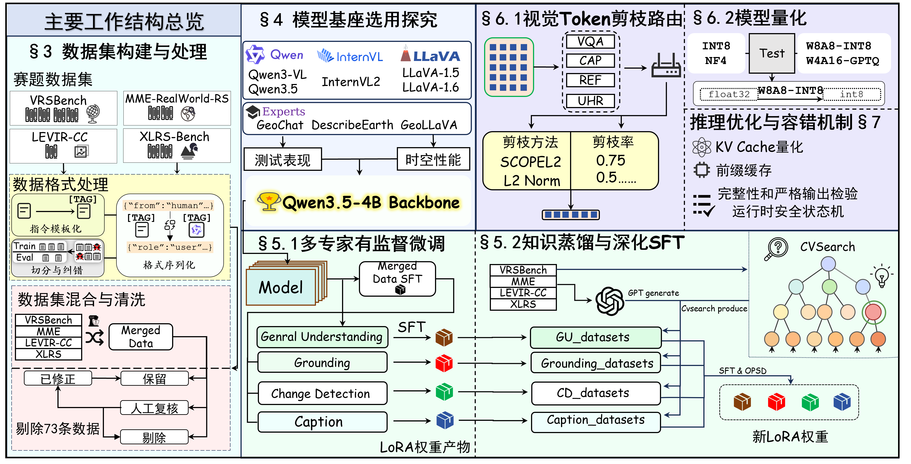
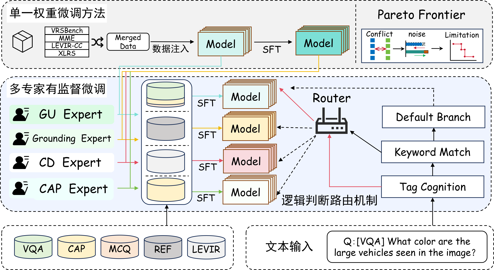
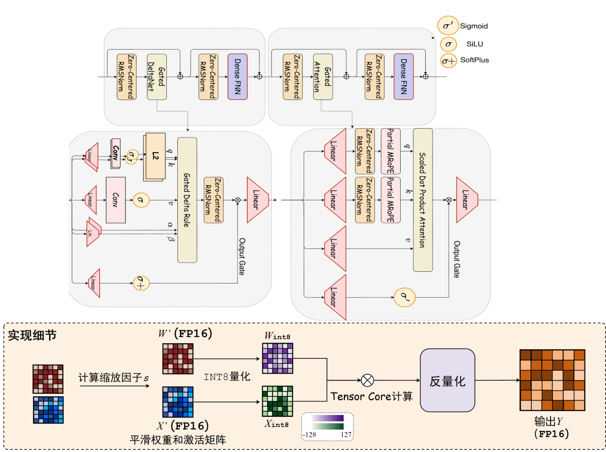

## 目录

- [一、基本信息](#一基本信息)
  - [1.1 摘要](#11-摘要)
  - [1.2 主要工作](#12-主要工作)
  - [1.3 项目分工](#13-项目分工)
- [二、目录索引](#二目录索引)
- [三、项目概述](#三项目概述)
  - [2.1 整体架构图](#21-整体架构图)
  - [2.2 数据集构建与处理](#22-数据集构建与处理)
  - [2.3 基座模型选型](#23-基座模型选型)
  - [2.4 模型训练与知识注入](#24-模型训练与知识注入)
  - [2.5 模型轻量化](#25-模型轻量化)
  - [2.6 星载容错与故障恢复](#26-星载容错与故障恢复)
  - [2.7 整体评测与验证](#27-整体评测与验证)
- [四、快速开始](#四快速开始)
  - [3.1 硬件要求](#31-硬件要求)
  - [3.2 环境配置](#32-环境配置)
  - [3.3 数据与模型准备](#33-数据与模型准备)
    - [3.3.1 评测图片：已有官方数据放哪里](#331-评测图片已有官方数据放哪里)
    - [3.3.2 模型：下载到本地（评测前准备好）](#332-模型下载到本地评测前准备好)
  - [3.4 模型推理](#34-模型推理)
  - [3.5 模型评测](#35-模型评测)
  - [3.6 模型训练](#36-模型训练)
- [五、实验结果](#五实验结果)
  - [5.1 评测口径说明](#51-评测口径说明)
  - [5.2 最终方案整体性能](#52-最终方案整体性能)
  - [5.3 资源开销与量化收益](#53-资源开销与量化收益)

---

## 一、基本信息

### 1.1 摘要

随着多模态大模型（MLLMs）的变革性发展与太空智算科技的兴起，运用其强大的理解能力来克服卫星图像处理中面临的高分辨率解析困难与泛化能力弱等挑战已成为当前的重要课题。然而，现有的通用大模型难以直接适应超高分辨率的遥感图像，且卫星平台严苛的算力与内存瓶颈进一步限制了其端侧部署。

为突破通用模型能力的限制，本团队针对星载任务的难度大、资源极度受限的特点，设计了一套高效的、出色的多模态大模型轻量化部署方案。整个方案按序完成了数据集处理——基座模型选型——模型训练——模型轻量化——容错与故障恢复机制的设计链条，成功基于轻量的模型达到了优秀的表现效果。在基座选型上，本方案对比了目前先进的Qwen、LLaVA、InternVL通用多模态大模型系列及部分遥感专家模型，充分比较了模型的表现与实际应用场景，最终选定 **Qwen3.5-4B** 作为方案的模型基座。鉴于所有的通用模型基座在赛题数据集，尤其是高分辨率的两个数据集上的表现存在如输出格式错误和指令遵循能力差的明显缺陷，本方案深入调研了当前有效的模型训练方法，并引入了本团队先前在ICML26中提出的CVSearch框架。基于四个指定的竞赛数据集，本方案协同应用了多专家有监督微调与在线策略蒸馏的训练方法，显著增强了模型对复杂遥感任务的适应性，使模型基座的性能完成了质变。接下来，为了丰富训练数据，团队利用GPT模型生成了数千条额外数据，并依此进行深化的微调工作，进一步优化了模型在任务中的表现效果。

在模型轻量化的方面，我们结合了视觉Token剪枝与模型量化策略。我们通过消融实验发现，不同的数据集和任务类型对于视觉Token剪枝的敏感性和方法要求是有显著差异的。基于这个发现，我们基于免训练的视觉Token剪枝方法，设计了任务适应的Token剪枝路由机制。同时，我们使用了W8A8/W4A16训练后量化方法。该方法大幅减少了计算开销，将压缩存储开销控制在8G以内。随后，为了增强模型在太空辐射环境下的鲁棒性，我们实现了针对单粒子翻转的容错机制，保证了卫星侧推理的稳定性。实验表明，本方案在满足星载端侧严苛资源约束的同时，仍保持了优异的遥感理解与推理性能。

### 1.2 主要工作

1. 我们充分调研了赛题的具体需求、提供的数据集和当前的遥感多模态大模型工作成果，构建了从基座选型到星载端侧部署的完整技术链路；
2. 我们创新性地提出了一套多阶段协同训练方案。结合多专家有监督微调（SFT）、在线策略蒸馏（OPD）以及 CVSearch 框架，并通过大模型合成数据深化微调，我们成功大幅跨越了通用大模型在复杂高分辨遥感任务上的性能鸿沟；
3. 我们设计了任务适应的高效模型轻量化策略。我们提出了一种免训练的视觉 Token 剪枝路由机制，在精准削减冗余 视觉 Token 的同时保留了核心视觉特征，并配合 W8A8/W4A16 训练后量化，实现与星载硬件资源环境的适配；
4. 最终，我们实现了高可靠的星载容错机制。针对太空辐射环境，我们设计了应对单粒子翻转的底层容错与故障恢复策略，保障了极端严苛资源约束下的系统推理稳定性。

### 1.3 项目分工
<!-- 表格容器 -->
<div style="overflow-x: auto;">
  <table border="1" cellspacing="0" cellpadding="8" style="border-collapse: collapse; min-width: 1000px; table-layout: fixed; width: 100%;">
    <thead>
      <tr>
        <th style="width: 120px; white-space: nowrap;">姓名</th>
        <th style="width: 260px;">负责模块</th>
        <th>工作内容</th>
      </tr>
    </thead>
    <tbody>
      <tr>
        <td>
          <div style="white-space: nowrap; overflow: hidden; text-overflow: ellipsis;"><strong>赖培丰　</strong></div>
        </td>
        <td>模型训练、数据集处理</td>
        <td>
队长，参与整个部署方案的统筹，主要负责多专家微调路由设计工作。
        </td>
      </tr>
      <tr>
        <td>
          <div style="white-space: nowrap; overflow: hidden; text-overflow: ellipsis;"><strong>曹鹏宇</strong></div>
        </td>
        <td>模型训练、自进化框架设计</td>
        <td>
完成知识蒸馏、深化 SFT 、数据构造和自进化框架的设计。参与技术报告示意图绘制。
        </td>
      </tr>
      <tr>
        <td>
          <div style="white-space: nowrap; overflow: hidden; text-overflow: ellipsis;"><strong>王翰　</strong></div>
        </td>
        <td> 模型基座选用、视觉 Token 压缩</td>
        <td>
主要负责模型基座选取与视觉 Token 压缩路由设计工作。同时参与技术报告示意图绘制。
        </td>
      </tr>
      <tr>
        <td>
          <div style="white-space: nowrap; overflow: hidden; text-overflow: ellipsis;"><strong>曹忠博　</strong></div>
        </td>
        <td>视觉 Token 压缩</td>
        <td>
主要负责机动工作。参与视觉 Token 压缩方法调研与数据构造实验工作。
        </td>
      </tr>
      <tr>
        <td>
          <div style="white-space: nowrap; overflow: hidden; text-overflow: ellipsis;"><strong>孙昊　</strong></div>
        </td>
        <td>数据集处理、模型量化与故障机制设计</td>
        <td>
主要负责模型量化、推理优化与故障恢复机制设计。
        </td>
      </tr>
      <tr>
        <td>
          <div style="white-space: nowrap; overflow: hidden; text-overflow: ellipsis;"><strong>李刘鹏　</strong></div>
        </td>
        <td> CVSearch 框架设计</td>
        <td>
CVSearch 论文原作者。参与自进化框架设计主导与技术报告优化工作。
        </td>
      </tr>
    </tbody>
  </table>
</div>

---

## 二、目录索引

<details>
<summary><b>点击展开目录树</b></summary>

```
.
├── rsmllm/                  # 统一入口与懒加载（Python 包）
│   ├── console.py           #   交互式控制台（当前菜单显示：评测/推理）
│   ├── router_eval.py       #   一键路由专家评测（canonical 完整快照 + vLLM 0.26）
│   ├── models.py            #   模型懒加载（get_model：本地 models/ → ModelScope）
│   ├── data.py              #   数据懒加载（get_dataset / prepare_eval：图片+清单）
│   ├── quantize.py          #   W8A8/GPTQ 量化入口
│   ├── serve.py / webui.py  #   vLLM 推理服务 / WebUI
│   ├── router.py            #   多专家路由推理（前缀/关键词分发）
│   ├── config.py            #   集中配置（路径 / MODEL_REGISTRY / 报告参数）
│   └── eval_reporting.py    #   多协议指标生成与汇总
├── evaluation/              # 评测框架
│   ├── vllm_eval/           #   vLLM 0.26 离线评测器（vision_opd_vllm_eval.py 主入口）
│   │   ├── setup_env.sh     #     一键还原评测环境（uv 托管 Python 3.11 + vllm 0.26）
│   │   ├── manifests/       #     评测清单（首次由 build_sample_manifest 构建，不入库）
│   │   ├── schema.py / scoring.py   # 样例结构 + 官方计分（clean_correct）
│   │   └── model_policy.py  #     可信模型 profile（sha256 校验）
│   ├── main.py              #   transformers 批评测入口（--adapter qwen35vl/router）
│   ├── evalsets/            #   数据集加载（vrsbench/mme/xlrs/levircc/xlrs_caption/grounding）
│   ├── adapters/            #   模型适配器（qwen35vl / router / router_pruned / geoeyes 等）
│   ├── metrics/             #   指标（accuracy/bleu/rouge/cider/referring/meteor/mcq/grounding）
│   ├── router/              #   路由规则（rules.py）+ task-adaptive 剪枝配置
│   ├── prompts/             #   评测提示词模板
│   └── data/                #   评测子集清单（切片）
├── finetune_framework/      # 训练框架（Qwen-VL-Series-Finetune：SFT/DPO/GRPO）与任务数据
├── training/                # 训练方法补充
│   ├── distillation/        #   在线策略蒸馏 OPD / 在线自蒸馏 OPSD
│   ├── self_evolution/      #   CVSearch 自进化研究源码（独立环境，不属于 3.6 标准入口）
│   └── train_*_expert.sh    #   专家训练启动脚本
├── scripts/                 # 预处理 / 推理 / 工具
│   ├── preprocess_*.py       #   数据集预处理（vrsbench/mme/xlrs/levircc/caption/grounding）
│   ├── fetch_benchmark_data.py   # 评测图片下载（ModelScope / HF 镜像）
│   ├── fetch_training_data.sh    # 训练 json 懒加载（ModelScope）
│   ├── fetch_raw_images.sh       # 训练图片哈希重命名还原 assets
│   ├── build_sample_manifest.py  # 评测清单构建（Sample 格式，可移植路径）
│   ├── build_caption_expert_data.py  # Caption 双域数据构建
│   ├── generate_mcq_data.py      # 合成 MCQ 样本
│   ├── gen_expert_deltas.py      # 四专家 delta 生成与验证
│   ├── merge_checkpoint.sh       # LoRA → 完整模型合并
│   ├── load_base_with_delta.py   # W0 + delta 装配加载器
│   ├── inference.py              # 单图推理
│   ├── quant_tol_probe.py        # 位翻转容错探针
│   ├── training/                 # 训练 SLURM 阶段脚本（train.sh 一键）
│   └── train.sh                  # 训练一键启动（stage / all / --local）
├── prune/                    # 免训练视觉 token 剪枝（L2、SCOPE）与可视化
├── token_compression/        # token 压缩方法集（uniform/random/mmtok/l2norm/scope_l2/divprune/fourier）
├── quantization/             # 模型量化（W8A8/GPTQ：pyproject + setup_env.sh + uv.lock）
├── tolerance/                # 星载容错与故障恢复（README 说明）
├── deploy/                   # 一键部署脚本（GPU 自适应）
│   ├── deploy.sh             #   部署（推理/评估，可选微调）
│   └── fix_data_paths.sh     #   数据路径修复
├── datasets_data/            # 四数据集评测清单（messages jsonl）
├── docs/                     # 文档
│   ├── PROJECT_STRUCTURE.md  #   结构与技术报告章节对照
│   ├── EXPERIMENT_MAP.md     #   报告实验 ↔ 仓库脚本映射链
│   ├── HANDOFF.md            #   交接说明
│   ├── DEPLOY_FALLBACK.md    #   部署回滚路径
│   └── TODO_UPLOAD.md        #   待上传模块清单
├── assets/                   # 整体架构图等文档插图
├── rsmllm.sh                 # 交互式统一入口（自动选解释器）
└── setup.sh                  # 环境一键安装（conda/uv）
```

</details>

---

## 三、项目概述

本方案贯穿「数据集构建处理 — 基座模型选型 — 模型训练与知识注入 — 模型轻量化 —
星载容错与故障恢复 — 整体评测与验证」的完整链路，最终基于轻量化的 Qwen3.5-4B
基座与四个任务专家适配器，在满足星载端侧严苛资源约束的同时，于四个指定遥感基准上
保持了优异的理解与推理性能。整体流程如下。

### 2.1 整体架构图



### 2.2 数据集构建与处理

对赛题指定的 VRSBench、MME-RealWorld-RS、XLRS-Bench 与 LEVIR-CC 四个数据集进行
系统调研，掌握各数据集的任务类型、图像分辨率分布与语言特点。随后将异构数据源统一
转译为兼容 Qwen 基座的标准输入格式，完成数据清洗、错误修正与格式规范化，并通过
自动化规则检查与人工复核保证字段完整性与内容一致性。此外，团队利用 GPT 模型定向
生成数千条高质量指令微调合成数据，进一步丰富训练数据的覆盖度。

### 2.3 基座模型选型

围绕 LLaVA、Qwen、InternVL 三大通用多模态大模型系列，以及 GeoChat、DescribeEarth、
GeoLLaVA 等遥感专家模型，在四个数据集上系统评估各候选基座的零样本与少样本迁移
表现，同时考察推理时的时空资源开销。综合性能与效率权衡，最终选定具备原生动态分辨率
机制与混合注意力架构的 Qwen3.5-4B 作为部署基座。

### 2.4 模型训练与知识注入

针对四个数据集在任务类型、输出格式与图像分辨率上的显著差异，提出多专家有监督微调
策略：为视觉问答与多选题（General）、指代表达定位（Grounding）、双时相变化描述
（Change）与图像描述（Caption）四类任务分别训练独立的 LoRA 适配器，并通过轻量级
规则路由器按任务前缀与关键词动态激活对应专家，有效缓解多任务联合训练中的输出格式
冲突与性能权衡问题。



在此基础上，进一步引入在线策略自蒸馏（OPSD）：利用同一模型在局部高清视图上获得
更可靠的预测分布，作为全局视图的逐 Token 蒸馏监督信号，无需额外部署大参数教师模型
即可增强对细粒度遥感目标的感知。同时基于团队前期发表于 ICML 2026 的 CVSearch 框架，
将视觉搜索轨迹转化为区域-全局配对数据与定位纠错数据，形成「视觉搜索—轨迹筛选—
双路训练—验证升级」的自进化训练闭环。

### 2.5 模型轻量化

通过系统的消融实验探究六种免训练视觉 Token 剪枝方法在不同保留率下的性能变化，发现
不同任务对视觉 Token 保留率的敏感性存在显著差异。据此设计任务自适应的免训练视觉
Token 剪枝路由机制：为 VQA/MCQ 配置 L2 Norm 且保留 25%、为 Change/Caption 配置
L2 Norm 且保留 50%、为 Referring 配置 SCOPE L2 且保留 75%，在精准削减冗余视觉 Token
的同时最大程度保留核心视觉特征。

在模型量化方面，实测对比 W8A8-INT8 与 W4A16-GPTQ 两种离线训练后量化方案，两者均
未引入统计学意义上的精度退化，将部署存储分别压缩至 5.54 GB 与 3.81 GB，均满足星载
显存预算。



### 2.6 星载容错与故障恢复

针对太空辐射环境中的单粒子翻转效应，在软件层面设计不可变运行封套与完整性检查机制，
通过任务启动前的哈希冻结与运行中的哈希比对，实现文件层损坏的 100% 检测；同时构建
包含输入校验、推理执行、输出验收、重试与重载的运行时安全状态机，为推理链路提供
系统级的错误监测与故障恢复能力。

### 2.7 整体评测与验证

在四个数据集上对部署方案进行端到端的性能与资源开销验证，具体结果见
[五、实验结果](#五实验结果)。

---

## 四、快速开始

### 3.1 硬件要求

- **推理/评测**：NVIDIA Ampere 或更新架构；BF16 推荐显存 ≥ 24 GB，本仓库已在
  A100 40 GB 上验证。多专家常驻需要多卡，显存不足时可选 W8A8/GPTQ。
- **完整训练**：General 使用 4×A100 40 GB，Grounding final 使用 8×A100 40 GB；
  3.6 的命令可用单卡、单步 smoke test 验证链路，但不代表单卡能完成全量训练。
- **CPU**：建议 x86_64
- **内存**：推理/评测建议 ≥ 32 GB，完整训练建议 ≥ 128 GB
- **存储**：仅准备一种精度建议预留 ≥ 80 GB；全部 12 个模型或完整训练请预留
  ≥ 180 GB / ≥ 300 GB，并在开始前用 `df -h` 确认。
- **系统**：建议 Ubuntu 22.04

上述是可复现配置而非最低理论配置；不同图像分辨率、并发数和训练 checkpoint 保留
策略都会改变实际占用。

### 3.2 环境配置

**方式一：一键脚本（推荐）**

```bash
bash setup.sh                              # 通用工具环境（torch 2.8 cu128）
bash evaluation/vllm_eval/setup_env.sh     # 推理/评测环境（vLLM 0.26 cu129）
```

`setup.sh` 自动识别已安装的 **uv / conda**：有 `uv` 时按 `uv.lock` 精确安装并进入 `.venv`，没有 `uv` 时回退 conda；两者都没有时，先按下方「安装 uv（可选）」装好 `uv` 再重跑即可。

最终维护的安装、评测、推理和数据工具入口会按脚本位置定位仓库根目录：从其他
目录调用这些入口不会把结果写到调用者的临时 cwd。它们的相对模型/数据/输出路径
按仓库根目录解释；清单中的图片相对路径按清单文件所在目录解释。

若是刚克隆的仓库，先确保 Git LFS 文件已取回（Ubuntu 可执行
`sudo apt-get install git-lfs && git lfs install && git lfs pull`）。完整训练使用独立的
conda + nvcc 环境，严格按 3.6 第 1 步安装，不复用上面两个 `.venv`。

**方式二：Docker 容器（推理/评测）**

```bash
docker build -t rs-mllm .
mkdir -p .models results
docker run --gpus all -it \
  -v "$PWD/datasets:/app/datasets" \
  -v "$PWD/.models:/app/.models" \
  -v "$PWD/results:/app/results" \
  -p 7860:7860 rs-mllm bash
```

容器内仍从 `/app` 运行 `./rsmllm.sh`。Docker 镜像用于 3.3–3.5；3.6 完整训练需要
conda/nvcc 和多卡资源，请使用方式一。

**安装 uv（可选；仅当脚本提示找不到 uv/conda 时需要）**

```bash
# 任选一种：
curl -LsSf https://astral.sh/uv/install.sh | sh   # 官方安装脚本（uv 装到 ~/.local/bin）
# 或
python3 -m pip install --user uv
```

官方脚本装完后，新开终端即可直接使用 `uv`；若要在当前终端立即生效，执行 `source ~/.local/bin/env`。

> 评测器依赖 vllm 0.26，要用 `evaluation/vllm_eval` 的评测环境，不能用 3.2 的训练环境。
>
> 两套环境首次安装需下载数 GB 的 torch/nvidia/vllm wheel。若下载卡住无进度，
> 设置代理后重跑：`export HTTPS_PROXY=http://<代理>:<端口> HTTP_PROXY=http://<代理>:<端口>`。

### 3.3 数据与模型准备

评测 / 路由推理所需的评测图片与模型均采用**本地优先**：放好后不会再重复下载。
先准备数据与模型，再进入 3.4 推理 / 3.5 评测。

#### 3.3.1 评测图片：已有官方数据放哪里

官方数据集不随仓库重复分发。若已从赛题 / 官方渠道取得原始图片，按下面的**目录契约**
放到 `datasets/shared_datasets/<数据名>/` 即可；评测入口检测到图片就绪会直接复用，
不会重新下载：

```
datasets/shared_datasets/
├── VRSBench/                          # vrsbench: 官方 Images_val.zip 原文件名直放
│   └── images/val/P0003_0002.png      #   清单引用名 = 官方 image_id, 解压即用
├── MME-RealWorld-RS/                  # mme: 官方 images_resized/mme_*.png
├── XLRS-Bench-lite/                   # xlrs: images_resized/xlrs_00000.png (重编号)
├── XLRS-Bench_caption_en/             # xlrs_caption: images_exported/xlrs_caption_*.jpg
├── XLRS-Bench_visual_grounding_en/    # xlrs_grounding: images_exported_test/xlrs_vg_*.jpg
└── LEVIR-CC/                          # levircc: 官方 zip 原文件名直放
    └── images/test/A/test_000001.png
```

**命名规则**：
- VRSBench / LEVIR-CC：官方文件就是清单引用名（`P0003_0002.png` / `test_000001.png`），
  zip 解压后文件自然对上，无需改名；
- XLRS 三件套 / MME：清单引用的是**预处理重编号名**（`images_resized/xlrs_00000.png`、
  `images_exported/xlrs_caption_00000.jpg`），官方 HF 数据是 arrow 内嵌图；若你拿到的
  不是与清单同名的文件，建议让评测入口从官方源自动下载并导出（脚本会按 `index`
  列顺序重编号），或按上述命名规则手动对齐。


若没有官方数据，交互式控制台会在首次评测时从 ModelScope 自动下载测试集图片并
摆放到上述目录。若网络不稳，可先运行 `python scripts/fetch_benchmark_data.py --all`。

<!-- 摆放完成后可手动预构建评测清单（可选；不跑也不影响，首次评测会自动构建）：

```bash
python scripts/build_sample_manifest.py --all --images-root ../../../datasets/shared_datasets
``` -->
<!--
#### 3.3.2 评测图片：从 ModelScope 或 HuggingFace 下载

没有官方数据时，一键下载后自动摆放到 3.3.1 的目录：

```bash
# 方式一：一键(推荐, 约 8.8GB, 快) —— 从 ModelScope 下载已清洗裁剪的图片包
python scripts/fetch_benchmark_data.py --all
#   下载 6 个数据集的图片并自动摆放:
#   datasets/shared_datasets/VRSBench/        (vrsbench 9,350 张)
#   datasets/shared_datasets/MME-RealWorld-RS/ (mme 1,264 张)
#   datasets/shared_datasets/XLRS-Bench-lite/  (xlrs 800 张)
#   datasets/shared_datasets/LEVIR-CC/         (levircc 3,858 张)
#   datasets/shared_datasets/XLRS-Bench_caption_en/       (xlrs_caption 934 张)
#   datasets/shared_datasets/XLRS-Bench_visual_grounding_en/ (xlrs_grounding 844 张)

# 方式二：从 HF 官方源下载(全量, 体积大: XLRS 系列 38~127GB, 慢)
python scripts/fetch_benchmark_data.py --all --source hf
#   仅指定数据集:
python scripts/fetch_benchmark_data.py --dataset vrsbench --source hf
```

评测入口在图片缺失时也会自动执行上述下载（懒加载）；网络不稳时手动跑一次更可控。
下载完成后，首次评测会自动构建可移植评测清单到 `evaluation/vllm_eval/manifests/`
（见 `rsmllm/data.py::prepare_eval`）。

菜单路径：`./rsmllm.sh` → `[5] 数据预处理` → `download`。 -->

#### 3.3.2 模型：下载到本地（评测前准备好）

评测只使用以下 12 个专家模型，即 4 个专家 × 3 种精度：

| 专家 | BF16 | W8A8 | GPTQ |
|---|---|---|---|
| General（问答/选择题） | `expert_general` | `expert_general_w8a8` | `expert_general_gptq` |
| Grounding（目标定位） | `expert_ground` | `expert_ground_w8a8` | `expert_ground_gptq` |
| Change（变化描述） | `expert_change` | `expert_change_w8a8` | `expert_change_gptq` |
| Caption（图像描述） | `expert_caption` | `expert_caption_w8a8` | `expert_caption_gptq` |

模型统一下载到交互式控制台使用的 ModelScope 缓存根目录 `.models/`。实际快照位于
`.models/models/<组织--仓库>/snapshots/<版本>/`；目录中已有完整模型时会自动复用，
不会重复下载或再复制到 `models/`。

一次下载全部 12 个模型：

```bash
evaluation/vllm_eval/.venv/bin/python scripts/fetch_models.py --all
```

也可以只下载一种精度，每条命令会下载该精度下的 4 个专家：

```bash
# 4 个 BF16 专家
evaluation/vllm_eval/.venv/bin/python scripts/fetch_models.py --quant bf16

# 4 个 W8A8 专家
evaluation/vllm_eval/.venv/bin/python scripts/fetch_models.py --quant w8a8

# 4 个 GPTQ 专家
evaluation/vllm_eval/.venv/bin/python scripts/fetch_models.py --quant gptq
```

只下载某一个专家的三种精度时，直接提供表格中的三个别名。例如：

```bash
# General 专家的 BF16、W8A8 和 GPTQ
evaluation/vllm_eval/.venv/bin/python scripts/fetch_models.py \
  expert_general expert_general_w8a8 expert_general_gptq
```

模型来自 ModelScope 的 `Fun10165/rs-mllm-*` 仓库。下载完成后，`route` 和
`single` 评测都会优先使用本地模型；离线运行可设置
`export MODELSCOPE_OFFLINE=1`。

### 3.4 模型推理

在仓库根目录运行控制台并选择 `[2] 推理服务`：

```bash
./rsmllm.sh
```

按提示选择 `bf16`、`w8a8` 或 `gptq`。服务包含 General、Grounding、Change 和
Caption 四个专家；模型未下载时会自动从 ModelScope 获取。每次请求都会根据 prompt
中的任务前缀和关键词自动选择专家，例如 `[VQA]`、`[REF]`、`[CD]` 和 `[CAP]`。

当前 Router 会对**每一条 prompt 独立路由**，不会只根据第一条消息永久锁定专家。
若想在后续提问中继续使用同一个专家，建议每条 prompt 都保留对应的任务前缀；没有
明确前缀或关键词时默认使用 General。页面会显示历史消息，但当前模型请求只包含
本次上传的图像和 prompt，因此追问时应补充必要的上下文。

| Expert | 适用任务 | 推荐 prompt 示例 |
|---|---|---|
| General | 遥感问答、选择题 | `[VQA] What objects are visible in this image?` |
| Grounding | 查找目标并输出位置框 | `[REF] Locate the building and return its bounding box.` |
| Change | 对比两张图像的变化 | `[CD] Describe the changes between these two images.` |
| Caption | 生成完整图像描述 | `[CAP] Provide a detailed description of this image.` |

- **WebUI（推荐）**：直接回车采用默认模式，打开 `http://127.0.0.1:7860`，上传图片
  并输入上述 prompt。单卡首次请求会现场加载命中的专家，需要等待约 1 分钟。
- **CLI**：输入 `cli`，在 `router>` 后输入 prompt，按 `Ctrl+C` 退出。CLI 不接收图片，
  主要用于检查文本路由和服务状态；真实多模态请求请使用 WebUI。

在远程服务器运行 WebUI 时，可在本地建立端口转发后访问：

```bash
ssh -L 7860:127.0.0.1:7860 <服务器>
```

WebUI 会显示本次命中的 expert。多卡环境会让四个专家常驻并自动分配 GPU；单卡环境
只加载当前命中的专家，切换任务时会自动换模型，因此首次请求会稍慢。模型评测方法见 3.5。

<!-- `[3]`–`[8]` 的实现和数字入口仍保留在代码中，目前只是不显示在菜单里。 -->

<!--
旧版 3.4 详细说明保留：多专家服务可通过 scripts/start_router.sh 启动，
交互路由入口为 python -m rsmllm.router --chat。模型别名定义在
rsmllm/config.py::MODEL_REGISTRY；general/grounding canonical 模型已经完成一次
base + delta + PEFT LoRA 合并，不应再次叠加 LoRA。change/caption 为 base + delta，
量化模型由对应 canonical 快照生成。
-->

### 3.5 模型评测

**交互式一键评测（推荐）**：数据与模型按 3.3 准备好后，在仓库根运行：

```bash
./rsmllm.sh
```

菜单选择 `[1] 评测实验`：

- **一路回车**：以 BF16 运行全部 4 个专家及其对应的 8 个任务。
- **route 模式**：使用与推理服务相同的 prompt 规则自动选择专家，并在评测前核验
  整个任务的路由结果。
- **single 模式**：手动选择一个专家，只评测该专家负责的任务。
- 可选择 `bf16`、`w8a8` 或 `gptq`；填写样本上限可进行快速测试。

评测结束后，控制台会汇总关键指标。详细结果保存在 `results/`，正式分见各结果
目录中的 `clean_summary.json`。

<details>
<summary><b>从原始推理结果重算全部指标（点击展开）</b></summary>

评测结果目录中的 `predictions.jsonl` 是唯一计分输入。可以在不重新推理的情况下，
自动生成多种可追溯的计分口径：

```bash
# 从结果目录读取 predictions.jsonl
evaluation/vllm_eval/.venv/bin/python \
  evaluation/vllm_eval/metrics_from_predictions.py \
  --run-dir results/<run-dir>

# 也可以直接指定原始 JSONL；输出目录默认是同目录下的 metrics/
evaluation/vllm_eval/.venv/bin/python \
  -m evaluation.vllm_eval.metrics_from_predictions \
  --predictions results/<run-dir>/predictions.jsonl
```

脚本会重算而不是信任 prediction 行中已有的 `score` 字段，并写出：

```text
results/<run-dir>/metrics/
├── metrics.json   # 完整结构化结果、来源 hash、prompt/reference hash
├── metrics.csv    # 展平后的逐组/逐指标表
└── metrics.md     # 人读速查表与口径说明
```

输出同时包含：

- source-answer 与 clean 两套离散 / 定位指标；
- legacy lexical proxy（`cider_tfidf_proxy` 明确不是官方 CIDEr）；
- 仓库当前 report implementation 的 BLEU、METEOR、ROUGE-L、CIDEr-D；
- `pycocoevalcap==1.2` + Stanford PTBTokenizer 的官方 COCO BLEU、METEOR、
  ROUGE-L、CIDEr；
- 原始值和报告百分数，明确记录 CIDEr 的原生 0–10 范围；
- attempts 文件的 latest successful attempt 选择、错误/截断/清洗过滤计数。

`--spice` 可额外运行官方 SPICE（需要 Java/CoreNLP 资源）；`--skip-coco` 只输出
不依赖 COCO 的指标；`--require-coco` 与 `--require-complete` 可用于验收时 fail closed。
评测器在完成新的 vLLM/Transformers run 后也会自动写入同样的 `metrics/` 目录。

</details>

#### 参考结果

使用当前仓库的 BF16 专家模型、完整测试集和默认参数时，可先确认每项的
`生成错误=0`，再对照 [五、实验结果](#五实验结果) 中的最终指标核验链路是否正确
（控制台末尾汇总与结果目录中的 `clean_summary.json` 亦为同一套正式口径）。

<!--
以下命令行、量化和实验级入口暂时隐藏，源码说明保留。

命令行方式：

```bash
# 一键路由专家评测（4 专家×对应任务；只选择量化方式）
evaluation/vllm_eval/.venv/bin/python -m rsmllm.router_eval --quant bf16
# 量化方式可选: bf16 / w8a8 / gptq
# 只跑某专家或快速验证: 追加 --experts general --limit 50
```

评测图片（已有官方数据摆放 / ModelScope、HF 下载）与模型准备见 3.3；
图片就绪后清单由入口自动构建（`rsmllm/data.py::prepare_eval`），也可用 3.3.1 的命令手动预构建。
按指定数据集/子任务评测单模型请用上面的 single 交互（底层即 vLLM 评测器），
不要直接跑 `evaluation/main.py`——那是队友实验用的 Transformers 链路，需根训练环境且慢约 150×。

**量化转换**（与报告同链路）：

```bash
python -m rsmllm.quantize --method w8a8-int8 --model mmerestore_bf16 \
  --calibration calibration_512.jsonl --output quantized_models/out
```

**容错探针 / TTFT / 并发扫描 / 剪枝**（实验级入口）：

```bash
python scripts/quant_tol_probe.py \
  --model bf16 --model-dir /path/to/bf16 \
  --model w8a8 --model-dir /path/to/w8a8 \
  --model gptq --model-dir /path/to/gptq \
  --out-dir results/quant_tol_probe     # 容错探针: 位翻转 + 哈希检测率 + 输出漂移
python scripts/ttft_serve_probe.py      # vLLM serve /metrics TTFT
python scripts/run_batch_scan.py        # 6 档并发吞吐/时延扫描
python evaluation/run_prune_sweep.py    # Token 剪枝方法扫描
```
-->

### 3.6 模型训练

下面是一条完整的线性复现流程：从 Base 模型开始完成五阶段训练，得到四个初始
专家，再对 General 和 Grounding 续训练，最后发布为评测/推理使用的四个专家。
所有命令都在仓库根目录执行，训练默认关闭 thinking。

#### 第 1 步：安装训练环境

```bash
conda create --override-channels -c conda-forge -n rs_mllm python=3.10 -y
conda activate rs_mllm
python -m pip install 'uv==0.12.8'
uv pip install --python "$CONDA_PREFIX/bin/python" --torch-backend cu128 \
  -r pyproject.toml \
  -r training/distillation/expert_lora/requirements.txt \
  'modelscope==1.39.1' 'modelscope-hub==0.3.0'
# DeepSpeed 导入和 CUDA 扩展编译需要与 cu128 匹配的 nvcc
conda install --override-channels -c nvidia/label/cuda-12.8.0 -c conda-forge \
  'cuda-nvcc=12.8.61' -y
export CONDA_ENV=rs_mllm
```

已验证环境：A100、Python 3.10.21、CUDA 12.8、PyTorch 2.8.0、
Transformers 5.13.0、DeepSpeed 0.17.5、PEFT 0.15.2。

#### 第 2 步：放置原始数据集

将原始数据按以下名称放到 `datasets/shared_datasets/`。该目录可以是软链；压缩包
需要先解压，XLRS 的 Hugging Face Arrow 文件可原样保留。

```text
datasets/shared_datasets/
├── MME-RealWorld-RS/
├── VRSBench/
├── XLRS-Bench-lite/
├── XLRS-Bench_visual_grounding_en/
├── LEVIR-CC/
```

原始图片不会被下面的脚本自动下载。MME 使用前请先阅读并同意其许可证。

#### 第 3 步：准备 Base 模型和五阶段数据

依次执行，不要跳步：

```bash
python scripts/stage_training35_models.py --download
python scripts/fetch_training35_data.py
python scripts/prepare_training35_images.py
python scripts/stage_training35_data.py
python scripts/preflight_training35.py
```

最后一条输出 `"passed": true` 且所有 `missing_images` 为 `0` 才能继续。生成的
训练清单位于 `datasets/training35/`。Base 模型和五阶段 JSON 分别来自 ModelScope
`Fun10165/qwen-3.5-rs` 与 `yasumi/rs-mllm-datasets`。

#### 第 4 步：运行五阶段训练

建议先用一张 GPU 跑一次最小 smoke test：

```bash
bash scripts/train.sh smoke-all --gpus 1 --max-updates 1
```

通过后，本地或 Slurm 二选一执行完整训练：

```bash
bash scripts/train.sh all          # 本地
# bash scripts/train.sh --slurm all  # Slurm；与上一条不要同时运行
```

该命令自动依次运行 `stage1_clean`、`ga2_general`、`a1_grounding`、
`a2b_change` 和 `caption`。四个初始专家位于：

```text
models/training35/runs/five-stage/merged/ga2_general    # General
models/training35/runs/five-stage/merged/a1_grounding  # Grounding
models/training35/runs/five-stage/merged/a2b_change    # Change
models/training35/runs/five-stage/merged/caption       # Caption
```

#### 第 5 步：准备 General/Grounding 续训练

先把五阶段产生的 General 和 Grounding 接入续训练入口：

```bash
python scripts/stage_training35_models.py --profile expert-lora \
  --general models/training35/runs/five-stage/merged/ga2_general \
  --ground models/training35/runs/five-stage/merged/a1_grounding \
  --replace-links
```

若只验收续训练链路、没有实际运行第 4 步，可改用
`python scripts/stage_training35_models.py --profile expert-lora --download`
下载已有的 General/Grounding 专家作为起点。

再下载续训练 JSON、恢复图片并预检。完整图片约需 74 GB，请先确认磁盘空间：

```bash
python scripts/fetch_training35_data.py --include-expert
python scripts/prepare_training35_images.py --include-expert
python scripts/stage_training35_data.py --include-expert
python scripts/preflight_training35.py --include-expert
```

续训练 JSON 来自 ModelScope `Uchitachi/RS-MLLM-Distillation-Data`。预检同样必须
显示 `"passed": true`。

#### 第 6 步：续训练 General 和 Grounding

```bash
ARTIFACT_ROOT="$PWD/models/training35/runs/training35-full"

# General：4 卡，484 updates
bash training/train_general_expert.sh \
  --gpus 4 --max-updates 484 --output-root "$ARTIFACT_ROOT"

# Grounding：先 bootstrap，再进行 final 续训练
bash training/train_grounding_expert.sh \
  --stage bootstrap --gpus 4 --max-updates 30 \
  --output-root "$ARTIFACT_ROOT"
bash training/train_grounding_expert.sh \
  --stage final --gpus 8 --max-updates 1370 \
  --init-lora "$ARTIFACT_ROOT/bootstrap/expert_ground_lora" \
  --output-root "$ARTIFACT_ROOT"
```

#### 第 7 步：合并 General/Grounding

```bash
bash scripts/merge_checkpoint.sh \
  --base models/expert_general \
  --lora "$ARTIFACT_ROOT/expert_general_lora" \
  --output "$ARTIFACT_ROOT/expert_general_full"

bash scripts/merge_checkpoint.sh \
  --base models/expert_ground \
  --lora "$ARTIFACT_ROOT/expert_ground_lora" \
  --output "$ARTIFACT_ROOT/expert_ground_full"
```

此时最终四个模型是 `expert_general_full`、`expert_ground_full`、`a2b_change` 和
`caption`。

#### 第 8 步：发布到评测和推理目录

```bash
python scripts/publish_trained_experts.py \
  --expert-root "$ARTIFACT_ROOT" \
  --replace-links
```

脚本检查四个模型后，将它们软链到 `models/expert_general`、
`models/expert_ground`、`models/expert_change` 和 `models/expert_caption`。评测与推理
会直接使用这些本地模型。脚本还会为每个训练产物生成绑定权重哈希的
`evaluation_profile.json`，因此 3.5 能在保留完整性校验的前提下直接评测新模型；
发布记录位于 `models/TRAINED_EXPERTS_MANIFEST.json`。

只检查命令而不训练时，可运行 `bash scripts/train.sh all --dry-run`；发布前也可以给
最后一条命令加 `--dry-run`。单阶段训练和数据/delta 重建脚本仅用于调试，不属于
上述标准复现流程。

---

## 五、实验结果

以下为最终部署方案的端到端评测结果。评测在哈尔滨工业大学（深圳）超算平台完成
（2× NVIDIA A100-PCIE-40GB），基于 vLLM 0.26 批量调度引擎、bf16 贪心解码，输入图像
分辨率控制在 200,704–2,097,152 像素之间。表中「基线」为未微调、未剪枝的原始
Qwen3.5-4B 基座，「bf16（多专家）」为多专家 LoRA 未量化档，「W8A8-INT8（最终部署）」
为默认部署档。

### 5.1 评测口径说明

- **离散任务**（VQA / Referring / MME / XLRS-lite）采用严格字符串精确匹配（strict），
  主口径不依赖外部大模型裁判；
- **描述任务**（VRSBench Caption、LEVIR-CC 变化描述、XLRS-Bench Caption）采用官方
  COCO Caption 协议（pycocoevalcap 1.2 + Stanford PTBTokenizer）；
- 表中数值均为百分制；不同任务间的指标定义与评测方式不同，数值不作直接横向比较。

### 5.2 最终方案整体性能

**VRSBench 与 MME-RealWorld-RS**

| 方法 | VQA Acc. | Caption CIDEr | Caption BLEU-4 | Caption ROUGE-L | Referring Acc@0.5 | MME Acc. |
|---|---|---|---|---|---|---|
| Qwen3.5-4B（基线） | 52.06 | ~0 | 2.19 | 16.16 | 1.81 | 35.55 |
| bf16（多专家，对照） | 70.91 | 36.27 | 15.03 | 37.52 | 77.11 | 72.11 |
| W8A8-INT8（最终部署） | 70.83 | 36.27 | 15.05 | 37.43 | 77.13 | 71.68 |

**XLRS-Bench Caption**

| 方法 | BLEU-1 | BLEU-2 | BLEU-3 | BLEU-4 | METEOR | ROUGE-L |
|---|---|---|---|---|---|---|
| bf16（多专家，对照） | 41.53 | 20.90 | 10.53 | 5.76 | 22.04 | 20.35 |
| W8A8-INT8（最终部署） | 41.58 | 20.82 | 10.38 | 5.54 | 22.03 | 20.27 |

**LEVIR-CC 双时相变化描述**

| 方法 | BLEU-1 | BLEU-2 | BLEU-3 | BLEU-4 | ROUGE-L | CIDEr |
|---|---|---|---|---|---|---|
| Qwen3.5-4B（基线） | 16.35 | 7.94 | 3.24 | 1.64 | 15.84 | ~0 |
| bf16（多专家，对照） | 80.95 | 70.49 | 61.37 | 53.08 | 74.13 | 136.37 |
| W8A8-INT8（最终部署） | 80.23 | 69.72 | 60.57 | 52.37 | 74.01 | 135.74 |

**XLRS-Bench Visual Grounding**

| 方法 | mIoU | Acc@0.5 | Acc@0.7 |
|---|---|---|---|
| Qwen3.5-4B（基线） | 10.2 | 10.5 | 6.9 |
| bf16（多专家，对照） | 15.89 | 17.59 | 11.38 |
| W8A8-INT8（最终部署） | 15.54 | 17.23 | 10.82 |

量化档（W8A8-INT8）相对 bf16 多专家档在八个任务上的精度变化均不超过 0.6 个百分点，
未引入明显的精度退化。

### 5.3 资源开销与量化收益

| 项目 | 数值 |
|---|---|
| 基座参数量（Qwen3.5-4B） | 约 4.66B |
| 专家 LoRA（4 个，各约 64.9M） | 合计约 259.6M |
| 系统总参数量 | 约 4.92B（远低于赛题 32B 上限） |
| 单专家激活参数量 | 约 4.72B |
| bf16 权重体积 | 9.10 GB |
| W8A8-INT8 部署体积 | 5.54 GB（-39.2%） |
| W4A16-GPTQ 部署体积 | 3.81 GB（-58.2%） |
| 推理峰值显存（vLLM 批量调度） | 约 10.3 GB |

量化收益（实测）：W8A8-INT8 将部署体积由 9.10 GB 压缩至 5.54 GB（-39.2%）、时延下降
约 13.1%；W4A16-GPTQ 进一步压缩至 3.81 GB（-58.2%）、时延下降约 7.6%，均满足星载
显存预算。默认部署采用 W8A8-INT8，存储优先场景采用 W4A16-GPTQ。时延数据为辅助
参考口径，详见 `quantization/README.md` 与 `docs/EXPERIMENT_MAP.md`。

---
